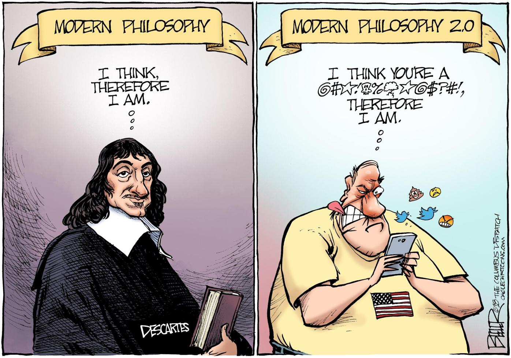

This report is an explorative analysis that derive from philosophy datasets. It is mainly focused on how philosophy evolved since Anicent Greek Philosophy period. By applying data mining, statistical analysis and visualization techinique in R environment, we had our preliminary exploration. 

The datasets contains over 300,000 sentences from over 50 texts spanning 10 major schools of philosophy. And it can be found via https://www.kaggle.com/kouroshalizadeh/history-of-philosophy. Since it is quite large, we do not include this in our Repository.

```{r setup, include=FALSE}
knitr::opts_chunk$set(echo = TRUE, warning = FALSE)
```


This report is prepared with the following environmental settings.
```{r}
print(R.version)
```


```{r include=FALSE}
library(tidyverse)
library(tidytext)
library(wordcloud)
library(tm)
```


```{r include=FALSE}
#Load data
data<-read_csv('C:/Users/wayne/OneDrive/Documents/GitHub/Fall2021-Project1-wanyexin/data/philosophy_data.csv')
```

At first, lets' have a brief view on our datasets to check if there's any important variables to know.
```{r echo=FALSE}
head(data)
```

```{r}
year= data%>%
  group_by(original_publication_date)%>%
  summarize(Counts=n())

year

p1_year= year%>%
  ggplot(aes(original_publication_date,Counts))+
  geom_bar(stat="identity")

p1_year
```


According to the distributions of original publication years from the philosophy sentence in our datasets,  the data are nearly composed by sentences either created in 300 B.C. or in 17th -20th century. Even though there is a distinct difference in amount between this two periods, since we can not guarantee this is a comprehensive modern philosophy collection, it is unreasonable to conclude that contemporary philosophy are not prevalent over time.

Hence after doing research on philosophy history, the scholar has divided philosophy into four period: ancient(700 B.C -500 A.D.), medieval(6th-16th Century), modern(16th-18th Century), contemporary(19th-21st Century), thus I applied this division to our datasets, it consists of three pieces(Ancient Greek Philosophy, Modern Philosophy, Contemporary Philosophy), which may indicate their characteristic change.  

```{r echo=FALSE}
#Generate three datasets according to their publication period
greek_data<-data%>%
  filter(original_publication_date==-350|original_publication_date==-320)

modern_data<-data%>%
  filter(original_publication_date>1600&original_publication_date<=1800)

contemporary_data<-data%>%
  filter(original_publication_date>1800)


greek_school=greek_data%>%
  group_by(school)%>%
  summarize(Counts=n())%>%
  mutate(School=fct_reorder(school,(Counts)))%>%
  ggplot(aes(x=School,y=Counts))+
  geom_bar(stat="identity")+
  labs(title="Ancient Greek Philosophy School")+
  coord_flip()

greek_school

modern_school=modern_data%>%
  group_by(school)%>%
  summarize(Counts=n())%>%
  mutate(School=fct_reorder(school,(Counts)))%>%
  ggplot(aes(x=School,y=Counts))+
  geom_bar(stat="identity")+
  labs(title="Modern Philosophy School")+
  coord_flip()

modern_school

contemporary_school=contemporary_data%>%
  group_by(school)%>%
  summarize(Counts=n())%>%
  mutate(School=fct_reorder(school,(Counts)))%>%
  ggplot(aes(x=School,y=Counts))+
  geom_bar(stat="identity")+
  labs(title="Contemporary Philosophy School")+
  coord_flip()

contemporary_school


```

According to the graph above, we find that the philosophy school are more diversified as period change.  But we are more interested in what reasons might leads such diversity, in fact it is strongly related to the historical background, and it depends on which stage of civilization grows that the philosopher lived in. But can we identify the eras' characteristics by observing those philosophers' thoughts?

At first,lets' check whether the authors tend to speak more complex sentences over time and results in a more clear category.  

```{r echo=FALSE, message=FALSE, warning=FALSE}
#Creating a new column to count the number of words, we used the tokenized text size to examine how complex a sentence is
greek_data['token_size']=lengths(gregexpr(",", greek_data$tokenized_txt))+1
modern_data['token_size']=lengths(gregexpr(",", modern_data$tokenized_txt))+1
contemporary_data['token_size']=lengths(gregexpr(",", contemporary_data$tokenized_txt))+1

greek_school_author= greek_data%>%
  group_by(author,school)%>%
  summarize(Words_amount= round(mean(token_size),2))

p1<-ggplot(greek_school_author,aes(x=reorder(author,Words_amount),y=Words_amount,fill=school))+
  geom_bar(stat="identity")+
  theme(legend.position="top")+
  labs(title="Most garrulous authors in Ancient Greek Period", x= "Author", 
    y= "Average number of words they Speak")+
  geom_text(aes(label=Words_amount), hjust=1.1,color="white", size=4)+ 
  coord_flip()


modern_school_author= modern_data%>%
  group_by(author,school)%>%
  summarize(Words_amount= round(mean(token_size),2))

p2<-ggplot(modern_school_author,aes(x=reorder(author,Words_amount),y=Words_amount,fill=school))+
  geom_bar(stat="identity")+
  theme(legend.position="top")+
  labs(title="Most garrulous authors in Modern Period", x= "Author", 
    y= "Average number of words they Speak")+
  geom_text(aes(label=Words_amount), hjust=1.1,color="white", size=4)+ 
  coord_flip()


contemporary_school_author= contemporary_data%>%
  group_by(author,school)%>%
  summarize(Words_amount= round(mean(token_size),2))

p3<-ggplot(contemporary_school_author,aes(x=reorder(author,Words_amount),y=Words_amount,fill=school))+
  geom_bar(stat="identity")+
  theme(legend.position="top")+
  labs(title="Most garrulous authors Contemporary Period", x= "Author", 
    y= "Average number of words they Speak")+
  geom_text(aes(label=Words_amount), hjust=1.1,color="white", size=4)+ 
  coord_flip()


p1
p2
p3
```

From the results above, it is obvious that each author have their own habit of the length they speak, When we compare the capitalism author Smith in modern philosophy, with other capitalism authors in contemporary philosophy, they all seems to speak around 32 words to express their thoughts. Capitalism philosopher in contemporary prefer to speak more explicitly, while analytic philosopher speak more reflectively.In addition, Descartes is an outlier from the rationalism in the aspect of sentence length. 




Now we are more interested in how does their philosophy topic evolves each period, we wish to observe some most frequently used words in each period.  
```{r echo=FALSE}
bag_of_words_greek <- greek_data %>%
  unnest_tokens(word, lemmatized_str)

word_count_greek <- bag_of_words_greek %>%
  count(word, sort = TRUE)

wordcloud(word_count_greek$word,word_count_greek$n ,
          scale=c(3,0.1),
          max.words=100,
          min.freq=1,
          random.order=FALSE,
          rot.per=0.3,
          use.r.layout=T,
          random.color=FALSE,
          colors=brewer.pal(9,"Oranges"))
```

```{r echo=FALSE}
bag_of_words_modern <- modern_data %>%
  unnest_tokens(word, lemmatized_str)

word_count_modern <- bag_of_words_modern %>%
  count(word, sort = TRUE)

wordcloud(word_count_modern$word,word_count_modern$n ,
          scale=c(3,0.1),
          max.words=100,
          min.freq=1,
          random.order=FALSE,
          rot.per=0.3,
          use.r.layout=T,
          random.color=FALSE,
          colors=brewer.pal(9,"Blues"))
```

```{r echo=FALSE}
bag_of_words_contemporary <- contemporary_data %>%
  unnest_tokens(word, lemmatized_str)

word_count_contemporary <- bag_of_words_contemporary %>%
  count(word, sort = TRUE)

wordcloud(word_count_contemporary$word,word_count_contemporary$n ,
          scale=c(3,0.1),
          max.words=100,
          min.freq=1,
          random.order=FALSE,
          rot.per=0.3,
          use.r.layout=T,
          random.color=FALSE,
          colors=brewer.pal(9,"Greens"))
```


However,in this three stages. Most frequent words are "the, be, pron" which are quite uninformative, So I cleaned those stop words and reorganized their sentence with key words. Usually, transfer those key words to the noun are more explanatory. 


```{r text processing in tm1, echo=FALSE, message=FALSE, warning=FALSE}
#The following process are for data cleaning purpose, clean stop words and tidy the text to the nouns.
corpus <- VCorpus(VectorSource(greek_data$sentence_str))%>%
  tm_map(content_transformer(tolower))%>%
  tm_map(removePunctuation)%>%
  tm_map(removeNumbers)%>%
  tm_map(removeWords, character(0))%>%
  tm_map(stripWhitespace)
```

```{r stemming, echo=FALSE, message=FALSE, warning=FALSE}
stemmed <- tm_map(corpus, stemDocument) %>%
  tidy() %>%
  select(text)
```

```{r tidy dictionary, echo=FALSE, message=FALSE, warning=FALSE}
dict <- tidy(corpus) %>%
  select(text) %>%
  unnest_tokens(dictionary, text)
```

```{r stopwords, echo=FALSE, message=FALSE, warning=FALSE}
data("stop_words")

word <- c()

stop_words <- stop_words %>%
  bind_rows(mutate(tibble(word), lexicon = "updated"))
```

```{r tidy stems with dictionary, echo=FALSE, message=FALSE, warning=FALSE}
completed <- stemmed %>%
  mutate(id = row_number()) %>%
  unnest_tokens(stems, text) %>%
  bind_cols(dict) %>%
  anti_join(stop_words, by = c("dictionary" = "word"))
```


```{r stem completion, echo=FALSE, message=FALSE, warning=FALSE}
completed <- completed %>%
  group_by(stems) %>%
  count(dictionary) %>%
  mutate(word = dictionary[which.max(n)]) %>%
  ungroup() %>%
  select(stems, word) %>%
  distinct() %>%
  right_join(completed) %>%
  select(-stems)
```


```{r reverse unnest, echo=FALSE, message=FALSE, warning=FALSE}
completed <- completed %>%
  group_by(id) %>%
  summarise(text = str_c(word, collapse = " ")) %>%
  ungroup()
```


```{r cleaned hm_data, echo=FALSE, message=FALSE, warning=FALSE}
greek_data <- greek_data %>%
  mutate(id = row_number()) %>%
  inner_join(completed)
```

```{r echo=FALSE}
bag_of_words_greek <- greek_data %>%
  unnest_tokens(word, text)

word_count_greek <- bag_of_words_greek %>%
  count(word, sort = TRUE)

wordcloud(word_count_greek$word,word_count_greek$n ,
          scale=c(3,0.1),
          max.words=100,
          min.freq=1,
          random.order=FALSE,
          rot.per=0.3,
          use.r.layout=T,
          random.color=FALSE,
          colors=brewer.pal(9,"Oranges"))
```
From the words cloud above, it shows ancient Greek philosopher contemplated and theorized about different ideas such as human nature, animal instinct. This demonstrated the fact that Plato are well-known scholar for ethics, virtue,justice, and other ideas relating to human behaviors.


```{r echo=FALSE, message=FALSE}
corpus <- VCorpus(VectorSource(modern_data$sentence_str))%>%
  tm_map(content_transformer(tolower))%>%
  tm_map(removePunctuation)%>%
  tm_map(removeNumbers)%>%
  tm_map(removeWords, character(0))%>%
  tm_map(stripWhitespace)
```

```{r echo=FALSE, message=FALSE}
stemmed <- tm_map(corpus, stemDocument) %>%
  tidy() %>%
  select(text)
```

```{r echo=FALSE, message=FALSE}
dict <- tidy(corpus) %>%
  select(text) %>%
  unnest_tokens(dictionary, text)
```

```{r echo=FALSE, message=FALSE}
data("stop_words")

word <- c()

stop_words <- stop_words %>%
  bind_rows(mutate(tibble(word), lexicon = "updated"))
```

```{r echo=FALSE, message=FALSE}
completed <- stemmed %>%
  mutate(id = row_number()) %>%
  unnest_tokens(stems, text) %>%
  bind_cols(dict) %>%
  anti_join(stop_words, by = c("dictionary" = "word"))
```


```{r echo=FALSE, message=FALSE, warning=FALSE}
completed <- completed %>%
  group_by(stems) %>%
  count(dictionary) %>%
  mutate(word = dictionary[which.max(n)]) %>%
  ungroup() %>%
  select(stems, word) %>%
  distinct() %>%
  right_join(completed) %>%
  select(-stems)
```


```{r echo=FALSE, message=FALSE}
completed <- completed %>%
  group_by(id) %>%
  summarise(text = str_c(word, collapse = " ")) %>%
  ungroup()
```


```{r echo=FALSE, message=FALSE, warning=FALSE}
modern_data <- modern_data %>%
  mutate(id = row_number()) %>%
  inner_join(completed)
```

```{r echo=FALSE}
bag_of_words_modern <- modern_data %>%
  unnest_tokens(word, text)

word_count_modern <- bag_of_words_modern %>%
  count(word, sort = TRUE)

wordcloud(word_count_modern$word,word_count_modern$n ,
          scale=c(3,0.1),
          max.words=100,
          min.freq=1,
          random.order=FALSE,
          rot.per=0.3,
          use.r.layout=T,
          random.color=FALSE,
          colors=brewer.pal(9,"Blues"))
```


From the modern philosophy words cloud, even though they still talks a lot about nature, scholar came up with new other ideas such as principle, mind, law. They dissect much more daily problem of modern human by way of integrated psychology, sociology, and culture anthropology. Because modern human is involved in a violent revolution no matter in the aspect of science or social movement.


```{r echo=FALSE, message=FALSE}
corpus <- VCorpus(VectorSource(contemporary_data$sentence_str))%>%
  tm_map(content_transformer(tolower))%>%
  tm_map(removePunctuation)%>%
  tm_map(removeNumbers)%>%
  tm_map(removeWords, character(0))%>%
  tm_map(stripWhitespace)
```

```{r echo=FALSE, message=FALSE}
stemmed <- tm_map(corpus, stemDocument) %>%
  tidy() %>%
  select(text)
```

```{r echo=FALSE, message=FALSE}
dict <- tidy(corpus) %>%
  select(text) %>%
  unnest_tokens(dictionary, text)
```

```{r echo=FALSE, message=FALSE}
data("stop_words")

word <- c()

stop_words <- stop_words %>%
  bind_rows(mutate(tibble(word), lexicon = "updated"))
```

```{r,warning=FALSE, message=FALSE,echo=FALSE}
completed <- stemmed %>%
  mutate(id = row_number()) %>%
  unnest_tokens(stems, text) %>%
  bind_cols(dict) %>%
  anti_join(stop_words, by = c("dictionary" = "word"))
```


```{r echo=FALSE, message=FALSE, warning=FALSE}
completed <- completed %>%
  group_by(stems) %>%
  count(dictionary) %>%
  mutate(word = dictionary[which.max(n)]) %>%
  ungroup() %>%
  select(stems, word) %>%
  distinct() %>%
  right_join(completed) %>%
  select(-stems)
```


```{r echo=FALSE, message=FALSE}
completed <- completed %>%
  group_by(id) %>%
  summarise(text = str_c(word, collapse = " ")) %>%
  ungroup()
```


```{r, warning=FALSE, message=FALSE,echo=FALSE}
contemporary_data <- contemporary_data %>%
  mutate(id = row_number()) %>%
  inner_join(completed)
```

```{r echo=FALSE}
bag_of_words_contemporary <- contemporary_data %>%
  unnest_tokens(word, text)

word_count_contemporary <- bag_of_words_contemporary %>%
  count(word, sort = TRUE)

wordcloud(word_count_contemporary$word,word_count_contemporary$n ,
          scale=c(3,0.1),
          max.words=100,
          min.freq=1,
          random.order=FALSE,
          rot.per=0.3,
          use.r.layout=T,
          random.color=FALSE,
          colors=brewer.pal(9,"Greens"))

```

As contemporary philosophy is the present period with increasing professionalization of the discipline and the rise of analytic and continental philosophy.The "World, time, object"  indicates that it focus on logic, aesthetics, the political sides, the scholars pursue the methods of claims of other area focus in science and social science.    